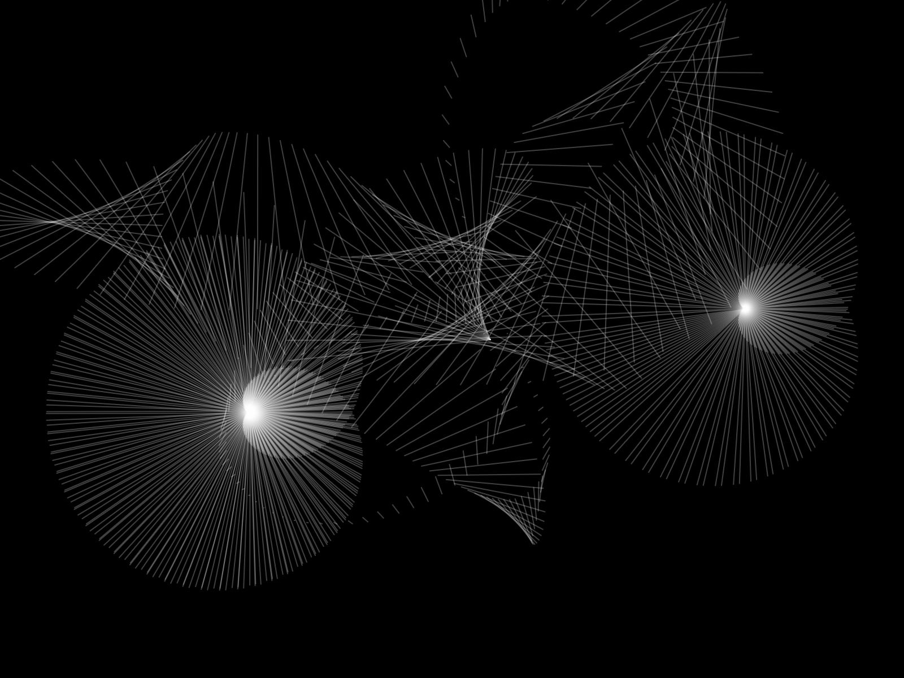

# E1. Cinetismi e interattività

Lavoro pubblicato: https://livinbits.github.io/aa2627-es/es1/

Il file `preview.png` va creato quando il lavoro è pronto: serve all'anteprima nella pagina delle revisioni del corso. Finché manca, qui sopra si vede il segno di un'immagine mancante ed è il modo più semplice per accorgersene.
